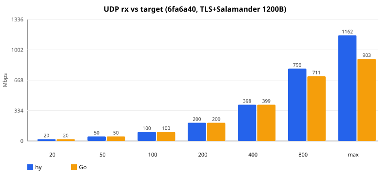
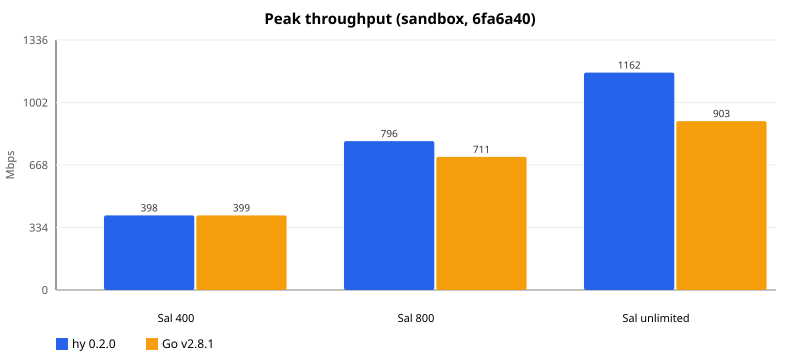
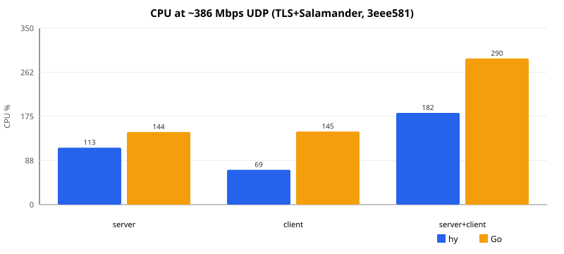
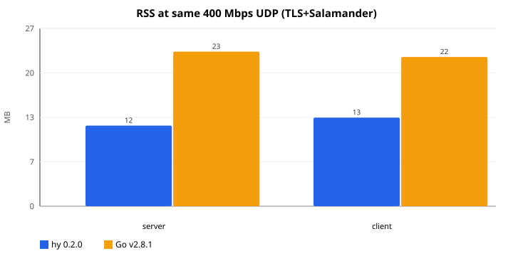

# hy — Hysteria 2 Rust rewrite

Protocol-compatible rewrite of [apernet/hysteria](https://github.com/apernet/hysteria) (v4 / Hysteria 2).

**使用说明（参数、场景示例）：[USAGE.md](USAGE.md)**

**不支持：**
- `tls.ech`（客户端）和 `ech` / `tls.ech.key`（服务端）。写了会拒绝启动，不会假装已藏 SNI。
- ACME `type: dns`（Cloudflare / DuckDNS / Porkbun 等 DNS-01）。写了会明确报错。HTTP-01 / TLS-ALPN-01 和自备 `tls.cert`/`key` 可用。

| Crate | Role |
|---|---|
| `hy-core` | Protocol, QUIC, Client/Server |
| `hy-extras` | Auth / ACL / outbound / sniff / masq / obfs / realm |
| `hy-app` | CLI `hy` + YAML + inbounds |

Dependency: `hy-app` → `hy-extras` → `hy-core`.

```
hy client -c client.yaml
hy server -c server.yaml
hy version
```

当前产品版本：[0.0.1](https://github.com/wusir27/hy/releases/tag/v0.0.1)。

---

## 沙箱性能（hy `3eee581` vs 官方 Go v2.8.1）

环境：8 vCPU / 16G，全部 `127.0.0.1`（CPU/用户态上限，不是网卡）。  
对比：本机 release `hy` `3eee581`（SHA `6a38032d…`）vs hysteria v2.8.1。路径：TLS + Salamander + `udpForwarding`，单流 1200B。warmup 3s + 测 12s。

### 限速阶梯（2026-08-18 复测）



| 目标 Mbps | hy rx | Go rx | hy 丢包 | Go 丢包 | hy CPU sv+cl | Go CPU sv+cl |
|---:|---:|---:|---:|---:|---:|---:|
| 20 | 19.3 | 19.3 | 0 | 0 | 21% | 47% |
| 50 | 48.3 | 48.3 | 0 | 0 | 34% | 103% |
| 100 | 96.6 | 96.6 | 0 | 0 | 66% | 142% |
| 200 | 193 | 193 | 0 | 0 | 97% | 205% |
| 400 | 386 | 386 | 0 | 0 | **182%** | **290%** |
| 800 | **756** | 688 | 2.1% | 11.0% | 334% | 391% |
| 不限速 | **841** | 650 | 51% | 76% | 352% | 322% |

400 Mbps 及以下两边都不丢（本轮灌包略低于标称目标）。800 和不限速 hy 更高、更不丢。

### 顶峰



### 相同 ~386 Mbps 资源





| | hy | Go |
|---|---:|---:|
| rx | 386 Mbps | 386 Mbps |
| server CPU | 113% | 144% |
| client CPU | 69% | 145% |
| **server+client CPU** | **182%** | **290%** |
| server / client RSS | 12 / 12 MB | 23 / 23 MB |

同速 hy CPU 约 Go 的 63%，RSS 约一半。数字只代表本沙箱 loopback。
